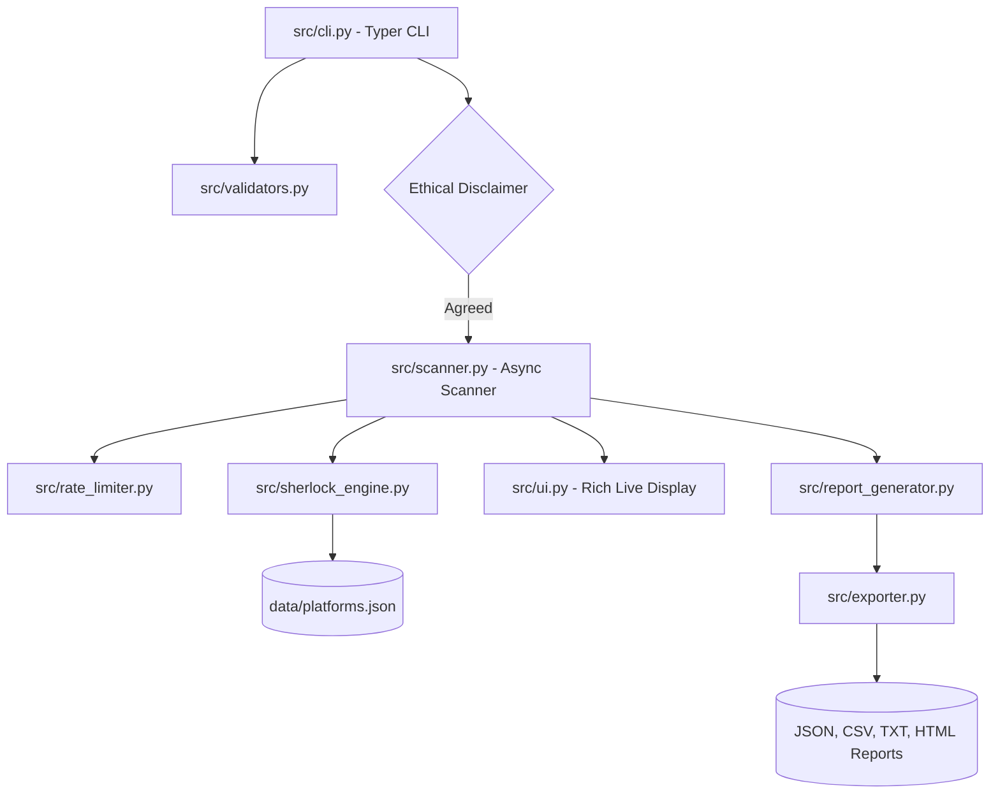

# Social Media Footprinting Tool (SMFT)

[](https://www.python.org/)
[](LICENSE)

SMFT is a professional, high-performance, asynchronous OSINT (Open Source Intelligence) digital footprint analysis tool. Given a username, SMFT probes dozens of online platforms concurrently to identify where the username exists. It aggregates matches, computes analytics metrics, and exports reports in various structured and human-readable layouts (JSON, CSV, TXT, HTML).

---

## Technical Architecture Overview


---

## Key Features
- **Concurrent Engine**: Utilizes Python `asyncio` and `httpx` for high-throughput profile lookups.
- **Robust Rate Limiter**: Token-bucket async throttling protects remote platforms.
- **Modern CLI Design**: Fully styled progress indicators, metrics panels, and tables using `rich`.
- **Flexible Exporters**: Outputs structured JSON, CSV spreadsheets, plaintext summaries, and premium responsive HTML pages.
- **Privacy Mode**: Protects targets by hashing or masking scanned usernames in persistent logs.

---

## Installation & Quickstart

### Prerequisites
- Python 3.11 or newer

### Setup
1. Clone the project and navigate to the root directory:
   ```bash
   cd SocialMediaFootprintingTool
   ```
2. Create and activate a clean virtual environment:
   ```bash
   python -m venv venv
   # On Windows:
   venv\Scripts\activate
   # On macOS/Linux:
   source venv/bin/activate
   ```
3. Install the dependencies:
   ```bash
   pip install -r requirements.txt
   pip install -r requirements-dev.txt
   ```
4. Setup environment variables configuration:
   ```bash
   copy .env.example .env
   ```

---

## Usage Guide

### Single Target Username Scan
To perform a standard scan on a single username:
```bash
python main.py scan testuser
```
*Note: An interactive prompt will display the mandatory ethical-use disclaimer, which requires manual approval `[Y/n]` before execution. To automatically bypass this gate (useful for CI/CD runs), supply the `--accept-disclaimer` flag:*
```bash
python main.py scan testuser --accept-disclaimer
```

### Batch Usernames Scan
To run sequential scans for multiple usernames listed inside a text file (one username per line, comments starting with `#` are automatically ignored):
```bash
python main.py scan --input usernames.txt
```

### Select Export Formats
By default, scans generate JSON, CSV, TXT, and HTML files in the `reports/` folder. To specify only particular outputs:
```bash
python main.py scan testuser --format json --format html
```

### Silent Machine-Readable Mode
To execute lookups silently and suppress tables or progress spinners:
```bash
python main.py scan testuser --quiet --format json
```

---

## Running the Test Suite
Ensure code robustness and coverage (aiming for >= 80% coverage):
```bash
pytest --cov=src --cov-report=term-missing tests/
```

---

## Security & Ethical Use Guidelines
> [!IMPORTANT]
> - This tool is designed **strictly for authorized security auditing, academic research, and personal digital footprint hygiene**.
> - It gathers data using public platforms URLs. It does not subvert authentication gates, bypass CAPTCHAs, or scrape private connections.
> - The operator is fully responsible for verifying compliance with local privacy laws and the terms of service of each tested platform before running scans.
